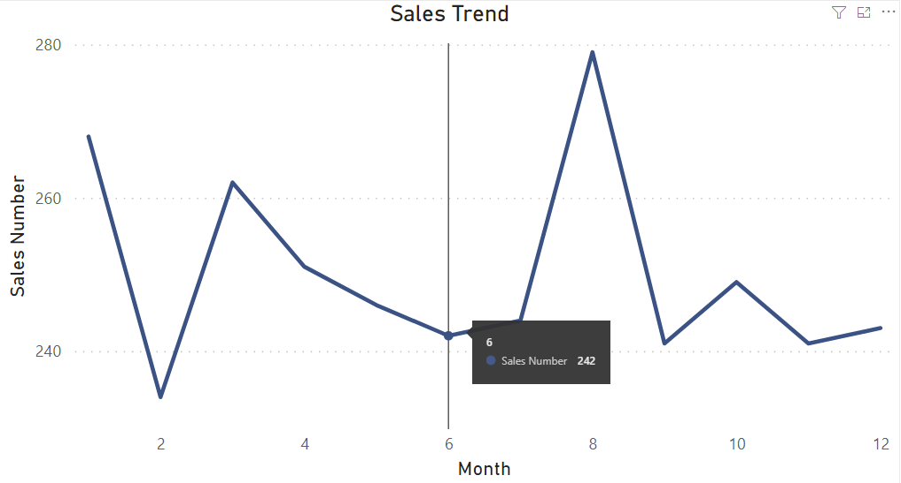
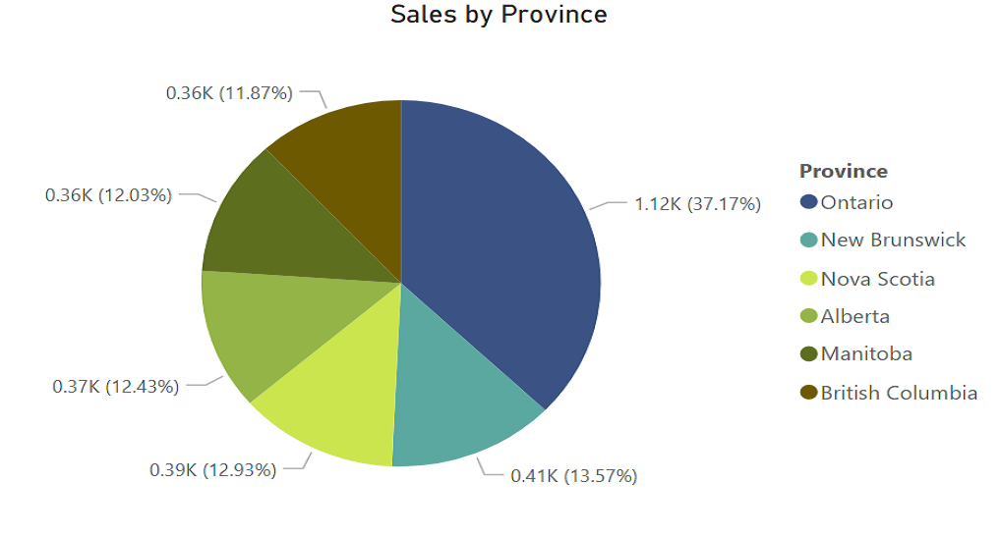
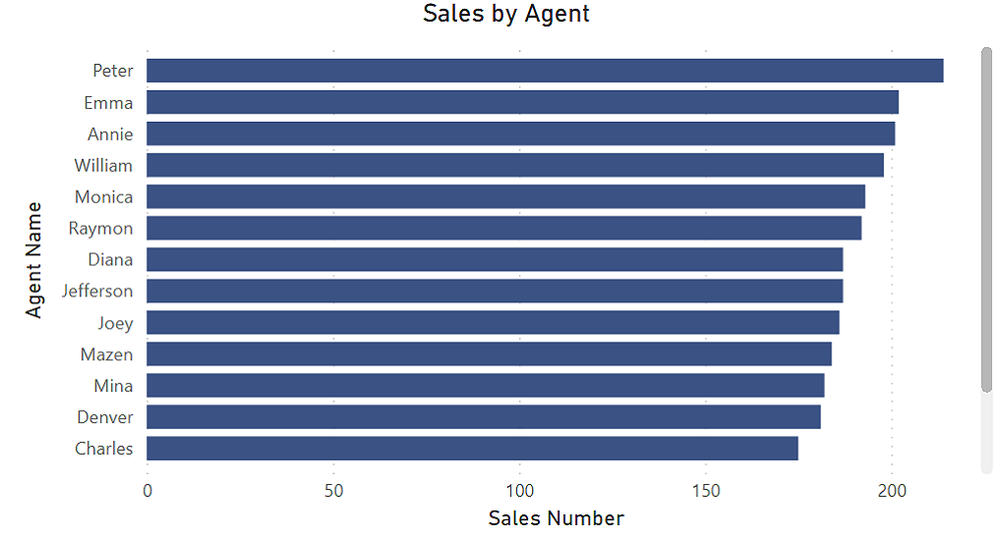
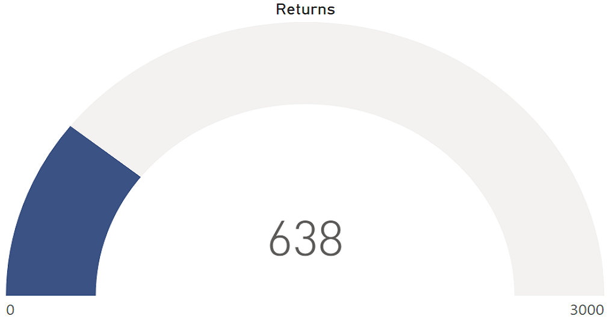
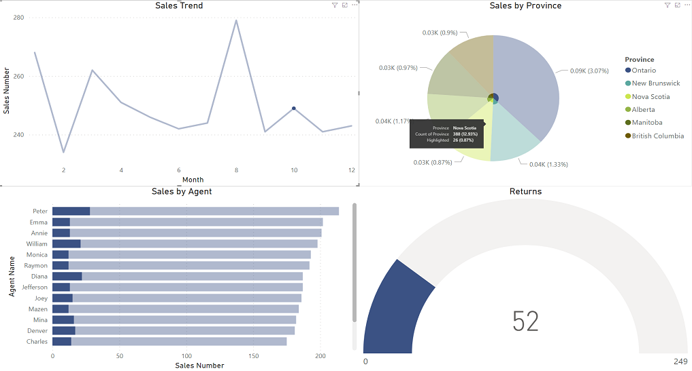

# Sales Analysis
## Overview
In this project, I created a sales report by using Power BI. The main idea of this project was to present the sales information.

## Resources
To create the data sample, I used Python to generate random values. The final datasets were in the resources folder.
- [sales info](https://github.com/Kun-kz/Sales_Analysis/blob/main/resources/summary.csv)
- [agents info](https://github.com/Kun-kz/Sales_Analysis/blob/main/resources/sales.csv)
- [month index](https://github.com/Kun-kz/Sales_Analysis/blob/main/resources/month_index.csv)

## Results
Picture1 presented the sales trend.

Picture1

- The sales numbers were presented by month.
- The number of sales showed up when the specific month was clicked.

Picture2 presented the sales information by province.

Picture2

- The product was sold in 6 provinces.
- The percentage of sales per province was presented.

Picture3 presented the number of products sold by each agent.

Picture3

Picture4 showed the products returned by customers.

Picture4

- 3000 units were sold in total and there were 638 of them returned by customers.

Picture5 ahowed how the charts responded to each other.

Picture5

- When a month was selected, the other three charts would correspond automatically and present the detailed information.

## Summary
In this project, I created a dashboard to present the sales information. Data was broken down by time, agent, and region. It helped us to discover additional details in the data.
